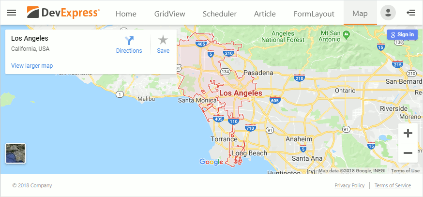

<!-- default badges list -->

<!-- default badges end -->
# ASP.NET Web Forms Controls - How to Create a Responsive Web Application

This example demonstrates how to create a web application with an adaptive layout based on [DevExpress ASP.NET Web Forms controls](https://docs.devexpress.com/AspNet/7873/aspnet-webforms-controls).

Refer to the following topic for more information: [Responsive Web Application](https://docs.devexpress.com/AspNet/120713/whats-installed/visual-studio-integration/template-gallery/responsive-web-application-template).

## Files to Review

* [FormLayout.aspx](./CS/ResponsiveWebApplication/FormLayout.aspx)
* [Map.aspx](./CS/ResponsiveWebApplication/Map.aspx)
* [ApplicationMenuDataSource.sitemap](./CS/ResponsiveWebApplication/App_Data/ApplicationMenuDataSource.sitemap)

## Documentation

* [DevExpress Template Gallery ](https://docs.devexpress.com/AspNet/11613/whats-installed/visual-studio-integration/template-gallery)

## More Examples

 * [ASP.NET MVC Extensions - How to Create a Responsive Web Application](https://github.com/DevExpress-Examples/mvc-responsive-web-application).
<!-- feedback -->
## Does this example address your development requirements/objectives?

 

(you will be redirected to DevExpress.com to submit your response)
<!-- feedback end -->
